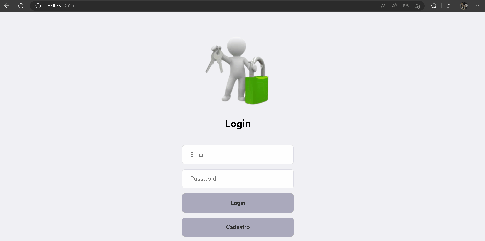

### ⚠️ Em desenvolvimento.
<br>

<h1 style="font-weight:bold">📘 Sobre</h1>
<p>
   Um projeto simples criado com o objetivo de consumir a API com React. O projeto consiste em um cadastro de 
   alunos, onde é possível realizar as principais tarefas de atualizar, excluir e incluir dados do aluno, também conseguindo pesquisar pelo nome.
</p> 

<br>

<div class="imagens">

   <div class="Front">
      <h1 style="font-weight:bold">📌 FrontEnd</h1>
      <ul>
         <li>Caso tente se cadastrar ou fazer o login sem alguma informação, aparece um alerta.</li>
      </ul>
      <div align="center">
         
   </div>

   <br>

   <div class="Swagger">
      <h1 style="font-weight:bold">📌 API de Alunos</h1>
       <ul>
         <li>Todos os endipoints do microsserviço Estão protegidos</li>
         <li>Foi criado um controller para se registrar e fazer login, assim, tendo acesso aos endpoints.</li>
      </ul>
      <div align="center">
         
      </div> 
   </div>

   <br>
</div>
<hr>

<br>

 > Pré-requisitos:

+ Sql server
+ node js
+ Dotnet 6


## Como rodar?

> Instruções para rodar no back.

No arquivo **_appsettings_** da api, precisa mudar a string de conexão do banco de dados na parte chamada **_"DefaultConnection"-**. Depois da conexão com o bando de dados estiver finalizada, abra o terminal do projeto e digite o seguinte comando abaixo:<br/>
Este comando vai ser responsável por atualizar seu banco de dados e colocar uma pequena carga inicial nele.

```
dotnet ef database update
```

> Instruções para rodar front.

Abra um terminal no VsCode, digite o comando abaixo para instalar os pacotes do projeto 

```
npm install
```
Depois de tudo instalado e configurado, coloca o back para rodar e depois o front.
